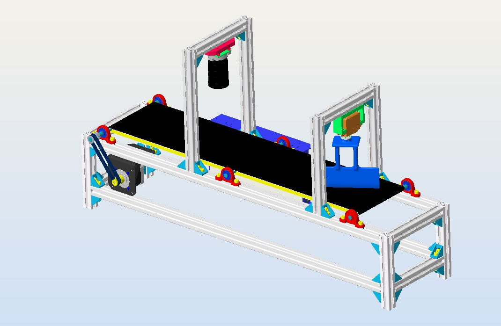
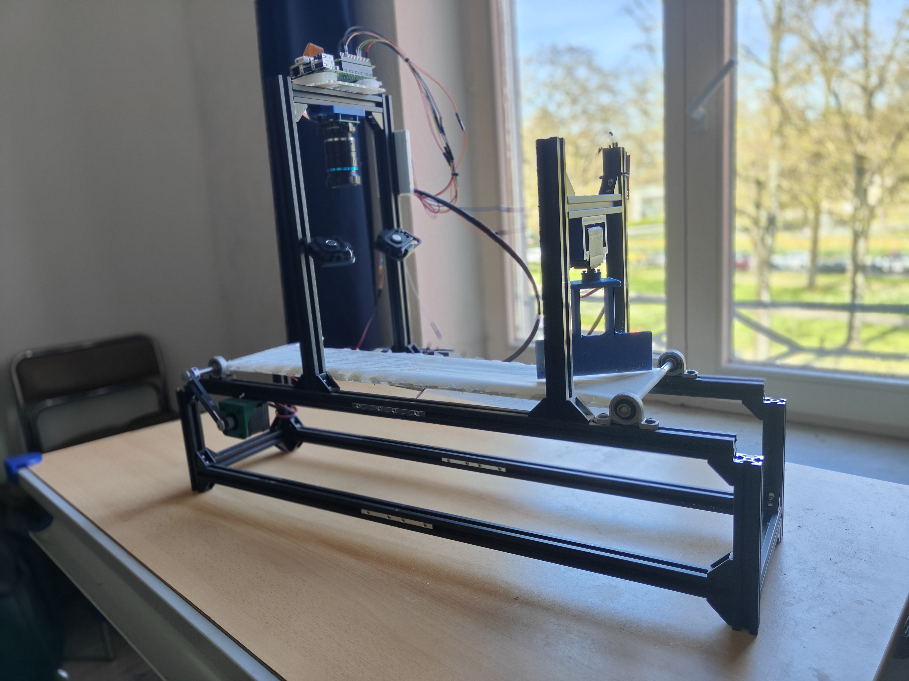

[](https://gbr-rl.github.io/VisionSort-RPi/)


# VisionSort-RPi 
**An AI-Powered Conveyor Belt Sorting System Using Raspberry Pi + YOLOv8 + Hailo**

A real-time bolt-and-nut sorting system powered by computer vision and embedded AI. This project blends hardware engineering with object detection and real-world automation — combines hardware engineering, object detection, and creative problem-solving to efficiently sort Bolts and Nuts.

---

## Overview

**VisionSort-RPi** is an edge-deployed conveyor belt system that showcases real-world applications of embedded AI.  
Built using **Raspberry Pi 5**, **YOLOv8**, and the **Hailo AI accelerator**, it automates object classification and sorting tasks with high accuracy and speed.

---

## 🖼️ 3D Model & Real Conveyor Sorting System

<table>
  <tr>
    <td align="center">
      <strong>3D CAD Model</strong><br>
      
    </td>
    <td align="center">
      <strong>Real Conveyor System</strong><br>
      
    </td>
  </tr>
</table>

> _Side-by-side view of the designed CAD model and the actual built system with camera and flapper mounted._


## 🎯 Key Features

- ✅ **Real-Time Object Detection** with YOLOv8 + Hailo for bolts and nuts
- ✅ **Stepper + Servo Motor Integration** for precise movement and sorting
- ✅ **Edge Deployment** on Raspberry Pi 5 with hardware-accelerated inference
- ✅ **Custom Dataset** with over 9,000 annotated training images
- ✅ **Optimized for speed** using neural network acceleration (Hailo RT)
- ✅ **Fully Autonomous Sorting** with no human-in-the-loop

---

## 🛠️ Tech Stack

| Category         | Tools & Hardware                               |
|------------------|-------------------------------------------------|
| 🧠 CV/AI          | YOLOv8, Roboflow, Python, OpenCV               |
| ⚙️ Embedded HW    | Raspberry Pi 5, Hailo AI Kit, NEMA 17, MG996R Servo  |
| 📷 Camera         | Raspberry Pi HQ Camera + 16mm 10MP Telephoto   |
| 🔌 Communication  | GPIO, PWM, I2C                                 |
| 📦 Dataset        | Roboflow custom-labeled (9000+ images)         |

---

## 🧠 Project Architecture

### 🔧 Hardware Design
- Conveyor belt driven by **NEMA 17 stepper motor**
- **Servo-controlled deflector arm** for object redirection
- HQ Camera with a **16mm telephoto lens** for accurate detection
- All powered and controlled via **Raspberry Pi 5**

### 🧪 Data + AI
- Pre-annotated dataset from **Roboflow**
- Bounding box labels with `nut` and `bolt` classes
- Trained on HPC using YOLOv8 custom config
- Inference optimized with **Hailo RT SDK**

---

### 🧰 Software Pipeline

1. **Camera Frame Capture** → 
2. **Image Preprocessing (OpenCV)** →
3. **YOLOv8 Inference (Hailo AI)** →
4. **Object Classification** →
5. **Motor Control Signal** →
6. **Stepper + Servo Movement**

---

## ⚙️ Setup Instructions

### 🔧 Hailo AI Environment Setup

This project utilizes **Hailo’s AI acceleration platform** for deploying YOLOv8 models on the Raspberry Pi 5.  
You can find the environment setup in their [official repo](https://github.com/hailo-ai/hailo-rpi5-examples).

#### 🛠️ Installation Steps

```bash
git clone https://github.com/hailo-ai/hailo-rpi5-examples.git
cd hailo-rpi5-examples
./install.sh
```

Every time you open a new terminal session, activate the environment:

```bash
source setup_env.sh
```

---

### 🚀 Running the Conveyor Sorting System

Run the real-time detection and sorting application using:

```bash
python detection/detection.py \
  --labels-json resources/nut_bolt-labels.json \
  --hef-path model/nut_bolt_model.hef \
  --input rpi
```

> Press `Ctrl+C` to stop the system gracefully.

---

## 🔌 Hardware Wiring Diagram

The wiring for the stepper and servo motor system was meticulously crafted for precise control and safety.  
Key components include the **TMC2208 stepper driver**, **MG996R servo motor**, **buck converter**, and **external 12V power supply**.

### 📄 Wiring Summary

| Component             | Raspberry Pi GPIO           | Notes                              |
|----------------------|-----------------------------|-------------------------------------|
| **TMC2208 - STEP**    | GPIO17 (Pin 11)             | Step signal                         |
| **TMC2208 - DIR**     | GPIO27 (Pin 13)             | Direction signal                    |
| **TMC2208 - EN**      | GND                         | Must be LOW to enable               |
| **TMC2208 - VIO**     | 3.3V                        | Logic level                         |
| **TMC2208 - GND**     | GND                         |                                     |
| **MG996R - SIGNAL**   | GPIO12 (PWM)                | Servo control via PWM               |
| **Servo Vcc**         | Buck Converter 5V           | Ensure stable 5V using multimeter   |
| **Buck Converter Input** | 12V external supply      | Powers motors + regulated 5V output |

📎 Full schematic is detailed in [`docs/Wiring_Setup.pdf`](docs/Wiring_Setup.pdf)

---

## 🧠 Training the YOLOv8 Model

The model used in this project is a **fine-tuned YOLOv8n** trained on a **custom Roboflow dataset** (9000+ images).

📜 Training script used: [`training.py`](training.py)

- Based on YOLOv8n.pt pretrained weights
- Trained to detect only two classes: `bolt` and `nut`
- Handled augmentation, batch balancing, and early stopping

---

## 🔄 Model Conversion for Hailo Deployment

YOLOv8 `.pt` model was converted to Hailo-compatible `.hef` format using the **Hailo Dataflow Compiler (DFC)**.

📓 Conversion steps are documented in [`Convert_YoloV8_to_HEF.ipynb`](Convert_YoloV8_to_HEF.ipynb)

### 🔁 Pipeline
- `.pt` → `.onnx` via Ultralytics export
- `.onnx` → `.hef` using Hailo’s `hef-generator` script

📚 Guide followed: [Guide to Using Hailo DFC](https://community.hailo.ai/t/guide-to-using-the-dfc-to-convert-a-modified-yolov11-on-google-colab/7131)

---

## 📽️ System Demonstration

> ⚙️ Real-time sorting demo using computer vision and Raspberry Pi:

🎥 [](https://www.youtube.com/watch?v=cI-RrebKUd8)

---

## 🛠️ What's Next?

- Add camera calibration + lighting normalization
- Expand dataset to include more object categories for diverse sorting applications.  
- Integrate IoT for remote monitoring. 
---

## 📩 Contact
I’m excited to connect and collaborate!  
- **Email**: [gbrohiith@gmail.com](mailto:your.email@example.com)  
- **LinkedIn**: [https://www.linkedin.com/in/rohiithgb/](https://linkedin.com/in/yourprofile)  
- **GitHub**: [https://github.com/GBR-RL/](https://github.com/yourusername)

---

## 📚 License
This project is open-source and available under the [MIT License](LICENSE).  

---

🌟 **If you like this project, please give it a star!** 🌟

